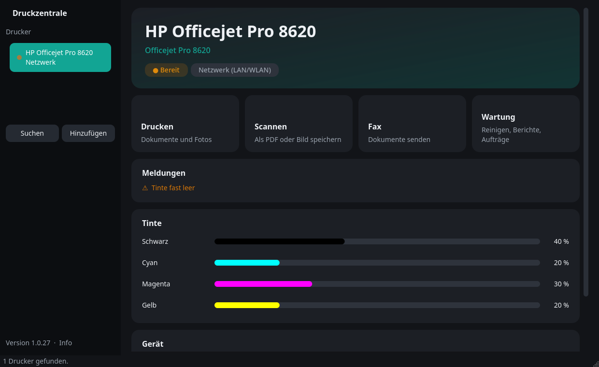
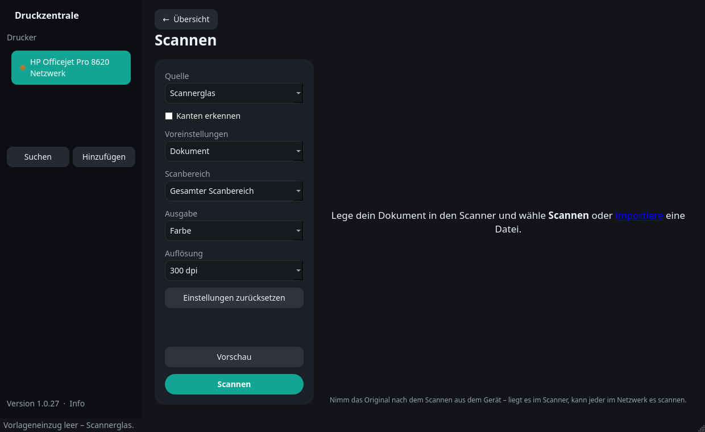

**Language / Sprache:** [🇬🇧 English](#druckzentrale) | [🇩🇪 Deutsch](#druckzentrale-1)

---

# Druckzentrale

Print, scan, fax, check ink or toner and maintain – for **printers on Linux**, in one simple window. Works over **USB, LAN and Wi-Fi** and with printers from any manufacturer that Linux supports. Standalone: no manufacturer software needed – for HP printers, fax, printhead cleaning and printer reports go straight through the printer's built-in interface.

Unofficial and independent – not made by or affiliated with any printer manufacturer. The interface is in German.



## Installation

Download the installer for your distribution from the [Releases](https://github.com/LucyWolf/druckzentrale/releases/latest) page and double-click it. The first time, your file manager asks whether it may run the file.

| Distribution | Installer |
|---|---|
| Arch / CachyOS / Manjaro | [`Druckzentrale-arch-installer.desktop`](https://github.com/LucyWolf/druckzentrale/releases/latest/download/Druckzentrale-arch-installer.desktop) |
| Debian / Ubuntu | [`Druckzentrale-deb-installer.desktop`](https://github.com/LucyWolf/druckzentrale/releases/latest/download/Druckzentrale-deb-installer.desktop) |
| Everything else (Fedora, openSUSE, …) | [`Druckzentrale-installer.desktop`](https://github.com/LucyWolf/druckzentrale/releases/latest/download/Druckzentrale-installer.desktop) |

The installer sets up everything with a single password prompt: Qt (PySide6, native Wayland), CUPS, free printer drivers (Gutenprint, Foomatic), Poppler (PDF for fax), SANE with sane-airscan, ipp-usb and Avahi. It turns on the printing service and network discovery, installs the app and adds a menu entry. Running it again offers **Update** or **Uninstall**.

<details>
<summary>Prefer the terminal?</summary>

```bash
curl -fsSL -o Druckzentrale-installieren.sh https://github.com/LucyWolf/druckzentrale/releases/latest/download/Druckzentrale-installieren.sh
bash Druckzentrale-installieren.sh
```
</details>

### Updates

Click **Version · Info** at the bottom left, then **Check for updates**. If a new version exists, a button also appears at the bottom left on its own. Installations of the former *HP Druckzentrale* move themselves over on the first start (program, menu entry, settings).

## Getting started

On the first start a wizard guides you: switch on the printer, connect it by USB or to the same network, **search**, **set up** (one password prompt) and give it a name – leave it empty to use the device name. A test page can be printed right away. More printers can be added later with **Add** in the sidebar.

## Using it

The sidebar lists your printers; the dot shows the state (green ready, orange message, grey not set up). The **overview** shows status, messages and ink or toner. The tiles lead to the functions, **← Overview** goes back. *Scan* and *Fax* only appear if the printer has them.

- **Print:** several files at once; copies, pages, color or black and white, paper size (only what the printer offers, e.g. A4, photo 10×15, envelopes, borderless), quality. *Print double-sided* is ticked by default if the printer can do it.
- **Scan:** source *document feeder* or *scanner glass* – the app notices paper in the feeder and switches by itself. Color by default; *Document* scans at 300 dpi, *Photo* at 600 dpi. Resolution and scan area only offer what the chosen source supports. Preview, edge detection, import of existing images, reorder pages; save as **PDF** (multi-page), **JPG, PNG, BMP, TIFF** or **WEBP**. Unsaved scans are not lost by accident – the app asks first.
- **Fax** (HP printers with PC fax, e.g. OfficeJet Pro): number, documents (PDF, images) or scanned pages, *Send*; the app shows dialing, connecting and sending and can cancel. A phone line must be connected to the printer.
- **Maintenance:** print jobs (view, cancel), test page, printer web interface, rename the printer, choose a picture for the printer type (stays on this PC), setup wizard, remove the printer. For HP printers additionally:
  - **Clean printhead** – starts with level 1; when the printer is done the app asks whether the print looks fine and only then goes to the next, more thorough level
  - print quality diagnostics, line feed calibration
  - reports: printer status, diagnostics, network/Wi-Fi, usage



## Tested printers

- HP OfficeJet Pro 8620

Other printers should work through the standards (IPP Everywhere/AirPrint for printing, eSCL for scanning) but have not been tried yet. Older printers without these standards need a driver; the free ones come with the installer, others only from the manufacturer. Printhead cleaning and reports are available for HP printers with a built-in web interface. Fax works with HP printers that offer PC fax through their built-in interface.

## Running from source

```bash
python3 druckzentrale.py
```

Needs PySide6, pycups and Pillow; the installer pulls in everything else.

**Releases (maintainers):** raise `APP_VERSION` in `druckzentrale.py` (the last digit counts up to 99), commit, push, run `tools/release.sh`.

License: MIT, see [LICENSE](LICENSE).

---

# Druckzentrale

Drucken, Scannen, Faxen, Tinte oder Toner und Wartung – für **Drucker unter Linux**, in einem einfachen Fenster. Funktioniert über **USB, LAN und WLAN** und mit Druckern jedes Herstellers, den Linux unterstützt. Eigenständig: keine Herstellersoftware nötig – bei HP-Druckern laufen Fax, Druckkopfreinigung und Berichte direkt über die eingebaute Schnittstelle des Druckers.

Inoffiziell und unabhängig – nicht von einem Druckerhersteller und nicht mit einem verbunden.


## Installation

Den Installer für deine Distribution von der [Releases](https://github.com/LucyWolf/druckzentrale/releases/latest)-Seite herunterladen und doppelklicken. Beim ersten Mal fragt der Dateimanager, ob er die Datei ausführen darf.

| Distribution | Installer |
|---|---|
| Arch / CachyOS / Manjaro | [`Druckzentrale-arch-installer.desktop`](https://github.com/LucyWolf/druckzentrale/releases/latest/download/Druckzentrale-arch-installer.desktop) |
| Debian / Ubuntu | [`Druckzentrale-deb-installer.desktop`](https://github.com/LucyWolf/druckzentrale/releases/latest/download/Druckzentrale-deb-installer.desktop) |
| Alle anderen (Fedora, openSUSE, …) | [`Druckzentrale-installer.desktop`](https://github.com/LucyWolf/druckzentrale/releases/latest/download/Druckzentrale-installer.desktop) |

Der Installer richtet alles mit einer einzigen Passwortabfrage ein: Qt (PySide6, nativ unter Wayland), CUPS, freie Druckertreiber (Gutenprint, Foomatic), Poppler (PDF fürs Fax), SANE mit sane-airscan, ipp-usb und Avahi. Er schaltet Druckdienst und Netzwerksuche ein, installiert die App und legt einen Menüeintrag an. Erneut gestartet bietet er **Aktualisieren** oder **Deinstallieren** an.

<details>
<summary>Lieber per Terminal?</summary>

```bash
curl -fsSL -o Druckzentrale-installieren.sh https://github.com/LucyWolf/druckzentrale/releases/latest/download/Druckzentrale-installieren.sh
bash Druckzentrale-installieren.sh
```
</details>

### Updates

Links unten auf **Version · Info** klicken, dann **Nach Updates suchen**. Gibt es eine neue Version, erscheint links unten auch von selbst ein Knopf dafür. Installationen der früheren *HP Druckzentrale* ziehen beim ersten Start selbst um (Programm, Menüeintrag, Einstellungen).

## Erste Schritte

Beim ersten Start führt ein Assistent durch: Drucker einschalten, per USB oder ins selbe Netz bringen, **suchen**, **einrichten** (eine Passwortabfrage) und einen Namen geben – leer lassen nimmt den Gerätenamen. Danach lässt sich gleich eine Testseite drucken. Weitere Drucker kommen später über **Hinzufügen** in der Seitenleiste dazu.

## Bedienung

Die Seitenleiste zeigt deine Drucker; der Punkt zeigt den Zustand (grün bereit, orange Meldung, grau nicht eingerichtet). Die **Übersicht** zeigt Status, Meldungen und Tinte oder Toner. Die Kacheln führen zu den Funktionen, **← Übersicht** zurück. *Scannen* und *Fax* erscheinen nur, wenn der Drucker sie hat.

- **Drucken:** mehrere Dateien auf einmal; Kopien, Seiten, Farbe oder Schwarzweiß, Papierformat (nur was der Drucker anbietet, z. B. A4, Foto 10×15, Umschläge, randlos), Qualität. *Beidseitig drucken* ist angehakt, wenn der Drucker es kann.
- **Scannen:** Quelle *Vorlageneinzug* oder *Scannerglas* – die App merkt, wenn Papier im Einzug liegt, und schaltet selbst um. Standard ist Farbe; *Dokument* scannt mit 300 dpi, *Foto* mit 600 dpi. Auflösung und Scanbereich bieten nur an, was die gewählte Quelle kann. Vorschau, Kanten erkennen, vorhandene Bilder importieren, Seiten sortieren; speichern als **PDF** (mehrseitig), **JPG, PNG, BMP, TIFF** oder **WEBP**. Ungespeicherte Scans gehen nicht versehentlich verloren – die App fragt vorher.
- **Fax** (HP-Drucker mit PC-Fax, z. B. OfficeJet Pro): Nummer, Dokumente (PDF, Bilder) oder gescannte Seiten, *Senden*; die App zeigt Wählen, Verbinden und Senden an und kann abbrechen. Am Drucker muss eine Telefonleitung angeschlossen sein.
- **Wartung:** Druckaufträge (ansehen, abbrechen), Testseite, Weboberfläche des Druckers, Drucker umbenennen, Bild für den Druckertyp wählen (bleibt auf diesem PC), Einrichtungs-Assistent, Drucker entfernen. Bei HP-Druckern zusätzlich:
  - **Druckkopf reinigen** – beginnt mit Stufe 1; ist der Drucker fertig, fragt die App, ob das Druckbild in Ordnung ist, und geht erst dann zur nächsten, gründlicheren Stufe
  - Druckqualitäts-Diagnose, Zeilenvorschub kalibrieren
  - Berichte: Druckerstatus, Diagnose, Netzwerk/WLAN, Nutzung


## Getestete Drucker

- HP OfficeJet Pro 8620

Andere Drucker sollten über die Standards (IPP Everywhere/AirPrint zum Drucken, eSCL zum Scannen) funktionieren, sind aber noch nicht ausprobiert. Ältere Drucker ohne diese Standards brauchen einen Treiber; die freien bringt der Installer mit, andere gibt es nur beim Hersteller. Druckkopfreinigung und Berichte gibt es bei HP-Druckern mit eingebauter Weboberfläche. Fax geht bei HP-Druckern, die PC-Fax über ihre eingebaute Schnittstelle anbieten.

## Aus dem Quellcode starten

```bash
python3 druckzentrale.py
```

Braucht PySide6, pycups und Pillow; alles andere holt der Installer.

**Releases (für Betreuer):** `APP_VERSION` in `druckzentrale.py` erhöhen (die letzte Stelle zählt bis 99), committen, pushen, `tools/release.sh` ausführen.

Lizenz: MIT, siehe [LICENSE](LICENSE).
